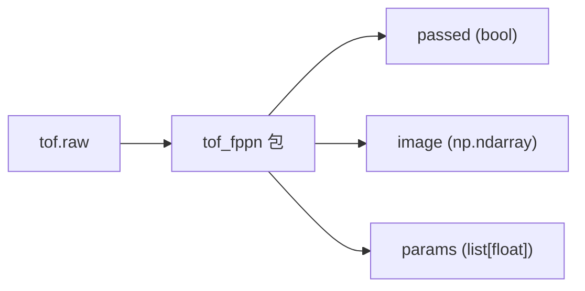

# tof_fppn

ToF FPPN（Fixed-Pattern Plane Noise）/ 几何标定 / 光度产测库。一次调用同时完成 **7 类产测**，
返回总判定、可视化结果图，以及一组结构化数值。



---

## 跑起来

```bash
pip install opencv-python numpy pillow scipy matplotlib
python run.py tof_60cm.raw
```

会弹出一张 1800px 宽的拼接图：
- **左侧 6 宫格**：亮度分布直方图 / 误差分布直方图 / 中心像素 62-bin 直方图 /
  亮度矩阵图 / 串光分布直方图 / 3D 点云 + 拟合平面。
- **右侧产测项目面板**：按 7 个分组列出每一项的 measured / 阈值 / [通过|失败]，
  右上角显示 **总判定: 通过 / 失败**。

---

## 在自己代码里调用

```python
from tof_fppn import run_all_checks

passed, image, params = run_all_checks("tof_60cm.raw")
# passed : bool
# image  : np.ndarray (H, W, 3) BGR，可直接 cv2.imshow / cv2.imwrite
# params : list[float] 长度 13，顺序固定为：
#   [f(px), ax(deg), ay(deg),
#    bias(cm),
#    rms(cm), worst(cm),
#    dead_pixels,
#    crosstalk_max, crosstalk_mean,
#    noise_max, noise_mean,
#    light_max, light_mean]
```

* `tof.raw` 路径相对调用时的 cwd，绝对路径也可以。
* 包内的 `thresholds.json` 由包自己用 `__file__` 锚定，在任何 cwd 下 import 都能正确工作。
* 中间产物全部落到 `tof_fppn/tmp/`，不污染调用方目录。

---

## 调阈值

所有阈值集中在 `tof_fppn/thresholds.json`，按物理意义支持三种写法：

| 写法 | 含义 | 适用 |
|---|---|---|
| `{ "max": X }`           | `value <= X`         | 越小越好的指标 |
| `{ "min": Y }`           | `value >= Y`         | 越大越好的指标 |
| `{ "min": Y, "max": X }` | `Y <= value <= X`    | 必须落在区间内 |

```json
{
  "dead_pixels":    { "max": 0      },

  "crosstalk_max":  { "max": 1000.0 },
  "crosstalk_mean": { "max": 300.0  },

  "noise_max":      { "max": 500.0  },
  "noise_mean":     { "max": 30.0   },

  "light_max":      { "min": 800.0  },
  "light_mean":     { "min": 500.0  },

  "f":              { "min": 50.0,  "max": 59.0 },
  "ax":             { "min": -5.0,  "max": 5.0  },
  "ay":             { "min": -5.0,  "max": 5.0  },

  "bias":           { "min": -35.0, "max": 5.0  },

  "rms":            { "max": 3.0   },
  "worst":          { "max": 6.0   }
}
```

> 单位说明：`f` 为像素；`ax / ay` 为度；`bias / rms / worst` 为 cm；
> `dead_pixels` 为整数；`crosstalk_* / noise_* / light_*` 都是 *最后两个 bin
> 饱和补偿后* 的 hist 值（无量纲）。

改完直接重跑，不需要改代码。

---

## 检测原理

raw 是 ToF Sensor 的 30 × 40 × 64 直方图。所有 max / mean 类指标都基于
**饱和补偿** 后的 hist：

```
bin_corr[k] = bin[k] * 50000 / (bin[62] * 1024 + bin[63])
```

| 分组 | 检测项 | 计算方式 |
|---|---|---|
| 几何标定 | `f / ax / ay` | 前 62 bin 三点重心 → 深度图；光心固定在图像中心、平面距离 `PLANE_DISTANCE_M = 1.4 m`，用 Powell 优化使 3D 点到拟合平面的 RMS 最小。 |
| FPPN 检测 | `bias` | 5×5 均值滤波后最近距离 − 平面距离。 |
| 平面度 | `rms / worst` | 残差均值；绝对残差降序前 1% 阈值。 |
| 坏点检测 | `dead_pixels` | 前 62 bin 全为 0 的像素数（要求严格 == 0）。 |
| 串光检测 | `crosstalk_max / crosstalk_mean` | 所有像素的 `bin_corr[0]` 的 max / mean。 |
| 底噪检测 | `noise_max / noise_mean` | 所有像素的 `bin_corr[30:50]` 在二维 × 20 个 bin 上的 max / mean。 |
| 打光强度 | `light_max / light_mean` | 每像素取 `max(bin_corr[0:62])`，再统计 max / mean（要求达到下限）。 |

`passed = 13 项 metric 全部落在 thresholds.json 规定的 [min, max] 内`。
