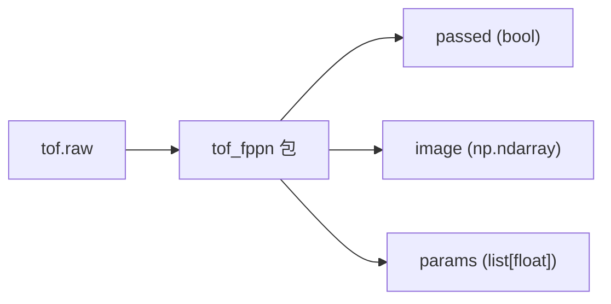

# tof_fppn

ToF FPPN（Fixed-Pattern Plane Noise）/ 几何标定产测库。一次调用同时完成
**几何标定**、**平面拟合误差**、**光度统计** 三类产测，返回总判定、可视化结果图，
以及一组结构化数值。



---

## 跑起来

```bash
pip install opencv-python numpy pillow scipy matplotlib
python run.py tof_60cm.raw
```

会弹出一张 1800px 宽的拼接图：
- **左侧**：误差分布直方图 + 3D 点云 / 拟合平面
- **右侧**：产测项目面板（几何标定 / 平面误差 / 光度统计），右上角显示 **总判定: 通过 / 失败**

---

## 在自己代码里调用

```python
from tof_fppn import run_all_checks

passed, image, params = run_all_checks("tof_60cm.raw")
# passed : bool
# image  : np.ndarray (H, W, 3) BGR，可直接 cv2.imshow / cv2.imwrite
# params : list[float] 长度 9，顺序固定为：
#   [f(px), bias(cm), ax(deg), ay(deg),
#    rms(cm), worst(cm), peak_mean, peak_max, peak_min]
```

* `tof.raw` 路径相对调用时的 cwd，绝对路径也可以。
* 包内的 `thresholds.json` 由包自己用 `__file__` 锚定，在任何 cwd 下 import 都能正确工作。
* 中间产物全部落到 `tof_fppn/tmp/`，不污染调用方目录。

---

## 调阈值

所有阈值集中在 `tof_fppn/thresholds.json`，每项必须同时给 `min` / `max`：

```json
{
  "f":         { "min": 50.0,  "max": 59.0   },
  "bias":      { "min": -35.0, "max": 5.0    },
  "ax":        { "min": -5.0,  "max": 5.0    },
  "ay":        { "min": -5.0,  "max": 5.0    },
  "rms":       { "min": 0.0,   "max": 3.0    },
  "worst":     { "min": 0.0,   "max": 6.0    },
  "peak_mean": { "min": 500.0, "max": 3000.0 },
  "peak_max":  { "min": 800.0, "max": 6000.0 },
  "peak_min":  { "min": 50.0,  "max": 600.0  }
}
```

> `bias / rms / worst` 单位为 **cm**；`f` 为像素，`ax / ay` 为度，
> `peak_*` 为亮度系数（无量纲）。

改完直接重跑，不需要改代码。

---

## 检测原理

raw 是 ToF Sensor 的 30 × 40 × 64 直方图，包内做三组检测。

* **几何标定** — 前 62 个 bin 找峰值 + 左中右三点重心得到深度图；以光心固定在
  图像中心、平面距离固定为 `PLANE_DISTANCE_M = 1.4 m` 为约束，用 Powell 优化
  `(f, ax, ay)`，使所有像素点反投影成 3D 点后到目标平面的 RMS 误差最小；
  `bias` 由滤波后最近距离与平面距离的差直接得到。检测项：`f / bias / ax / ay`。
* **平面误差** — 在最优参数下统计所有像素点到拟合平面的残差：
  `rms`（整体）和 `worst`（绝对误差降序的前 1% 阈值）。
* **光度统计** — 按 `max(bin0~61) * 50000 / (bin62*1024 + bin63)` 计算每像素亮度，
  统计 `peak_mean / peak_max / peak_min`，反映光源强度与 sensor 增益是否合规。

`passed = 9 项 metric 全部落在 thresholds.json 规定的 [min, max] 内`。
